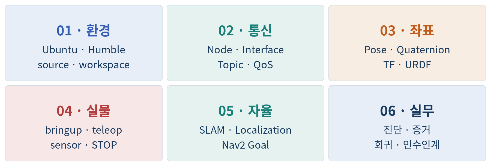

<p align="right">
  <strong>한국어</strong> ·
  <a href="README.en.md">English</a> ·
  <a href="README.zh-CN.md">简体中文</a>
</p>

<p align="center">
  
</p>

<h1 align="center">ROS 2 로봇 실습 강좌</h1>

<p align="center">
  <strong>TurtleBot3 Burger · Volume 1 · ROS 2 Humble</strong><br>
  Linux 생존선에서 SLAM·Localization·Nav2·현장 증거까지
</p>

<p align="center">
  <a href="https://kim-yongsu.github.io/ros2-robot-practice-course/"><strong>📘 온라인 교재 시작</strong></a>
  ·
  <a href="https://kim-yongsu.github.io/ros2-robot-practice-course/courses/burger/volume-1/"><strong>🚀 Burger 1권 온라인 강좌 시작</strong></a>
  ·
  <a href="https://kim-yongsu.github.io/ros2-robot-practice-course/courses/burger/volume-1/learning-map.html">🧭 학습 지도</a>
  ·
  <a href="https://kim-yongsu.github.io/ros2-robot-practice-course/courses/burger/volume-1/troubleshooting.html">🛠️ 문제 해결</a>
</p>

<p align="center">
  <a href="docs/source/index.md">GitHub에서 원문 보기</a>
  ·
  <a href="examples/README.md">예제 코드</a>
  ·
  <a href="ERRATA.md">오탈자·정정</a>
</p>

<p align="center">
  
</p>

---

## 처음 방문했다면

1. **[온라인 교재 홈](https://kim-yongsu.github.io/ros2-robot-practice-course/)**에서 전체 구조를 확인한다.
2. **[Burger 1권 시작](https://kim-yongsu.github.io/ros2-robot-practice-course/courses/burger/volume-1/start.html)**을 눌러 첫 Lesson부터 진행한다.
3. 각 Lesson에서 **준비 → 실행 → 관찰 → 기록** 순서로 학습한다.
4. 문제가 생기면 다음 단계로 넘어가지 말고 **[문제 해결](https://kim-yongsu.github.io/ros2-robot-practice-course/courses/burger/volume-1/troubleshooting.html)**에서 첫 FAIL 계층으로 돌아간다.

## 6 PART · 25 Lesson

| PART | 학습 범위 | 바로가기 |
|---|---|---|
| **1 · 환경 기준선** | 터미널, Ubuntu 22.04.5, ROS 2 Humble, source, workspace | [PART 1](https://kim-yongsu.github.io/ros2-robot-practice-course/courses/burger/volume-1/part-01-environment/) |
| **2 · 통신과 실행 증거** | Package, Node, Topic, Service, Action, Parameter, QoS | [PART 2](https://kim-yongsu.github.io/ros2-robot-practice-course/courses/burger/volume-1/part-02-communication/) |
| **3 · 발견·좌표·TF·URDF** | graph 진단, PoseStamped, TF authority, URDF 책임 | [PART 3](https://kim-yongsu.github.io/ros2-robot-practice-course/courses/burger/volume-1/part-03-frames/) |
| **4 · 실물 명령과 시뮬레이션** | `/cmd_vel`, bringup, 저속 teleop, Gazebo Classic | [PART 4](https://kim-yongsu.github.io/ros2-robot-practice-course/courses/burger/volume-1/part-04-hardware-sim/) |
| **5 · SLAM·Localization·Nav2** | 지도 품질, Initial Pose, Nav2 Gate, NavigateToPose | [PART 5](https://kim-yongsu.github.io/ros2-robot-practice-course/courses/burger/volume-1/part-05-navigation/) |
| **6 · 진단·증거·회귀·프로젝트** | 첫 실패 계층, RUN_ID, 회귀시험, 조별 프로젝트 완료 계약 | [PART 6](https://kim-yongsu.github.io/ros2-robot-practice-course/courses/burger/volume-1/part-06-evidence/) |

## 이 강좌로 할 수 있게 되는 것

- Ubuntu 22.04.5와 ROS 2 Humble 실행 기준선을 기록하고 복구한다.
- ROS graph의 이름만 보지 않고 type·endpoint·QoS·실제 message를 확인한다.
- frame·time·position·orientation과 TF authority를 구분한다.
- TurtleBot3 Burger의 bringup과 첫 저속 teleop을 STOP 조건과 함께 수행한다.
- SLAM 지도 품질, Localization 정합, Nav2 Goal 전제조건을 분리해 판정한다.
- 환경·ROS message·물리 관찰을 하나의 RUN_ID로 묶어 증거로 남긴다.
- 문제를 무작위로 튜닝하지 않고 첫 FAIL 계층에서 자른다.

## 학습 원칙

| 원칙 | 의미 |
|---|---|
| **FOLLOW** | 명령 위치와 환경을 확인하고 위에서 아래로 실행한다. |
| **VERIFY** | GUI나 이름만 보지 않고 값·로그·TF·Action 상태·물리 반응을 서로 다른 증거로 남긴다. |
| **STOP** | 정지 불가·발열·반복 disconnect·원인 미확인 상태에서는 다음 단계로 가지 않는다. |

## 검증 경계

문서와 정적 검증은 실제 장비 통합시험을 대신하지 않는다.

```text
실물 bringup
SLAM
Localization
Nav2 Goal·Cancel
물리 STOP
```

위 항목은 실제 실행 증거가 있어야 PASS다. 시뮬레이터 성공을 실물 성공으로 표현하지 않는다.

## 현재 공개 범위

- **공개:** TurtleBot3 Burger 1권, 한국어 본문, 6 PART, 25 Lesson, 예제와 품질 검사
- **준비 중:** Waffle Pi, Waffle Pi Tank, C2·6축 MoMa
- **번역:** 한국어가 정본이며 English·简体中文는 현재 안내용 landing page다.

## 저장소에서 찾을 수 있는 것

```text
docs/source/      온라인 교재 원문
examples/         실행 예제
tests/            문서·예제·접근성·출판 품질 검사
assets/           공개 도해
.github/workflows 품질 검사와 Pages 배포
```

<details>
<summary><strong>로컬에서 교재 빌드하기</strong></summary>

```bash
python -m venv .venv
source .venv/bin/activate
python -m pip install   -r docs/requirements.txt   -c docs/constraints.txt   -r requirements-dev.txt

python scripts/sync_assets.py
python -m sphinx -W --keep-going -b html docs/source docs/_build/html
python -m pytest -q
```

</details>

## 비공식 교육 자료

이 저장소는 Open Robotics, ROS 프로젝트 또는 ROBOTIS의 공식 문서가 아니다.
ROS와 TurtleBot3의 명칭과 표장은 각 권리자에게 속한다.

문서 이용조건은 [`COPYRIGHT-DOCS.md`](COPYRIGHT-DOCS.md), 코드 이용조건은 [`LICENSE-CODE`](LICENSE-CODE), 제3자 표기는 [`THIRD_PARTY_NOTICES.md`](THIRD_PARTY_NOTICES.md)를 확인한다.
